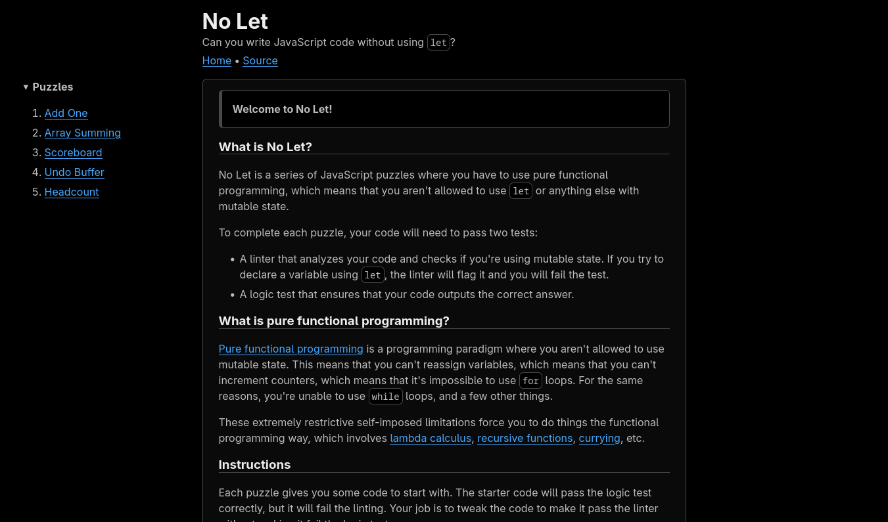

# No Let

[](https://ethmarks.github.io/nolet/)
[](https://github.com/ethmarks/nolet)

No Let is a JavaScript puzzle site where you have to use pure functional programming, which means that you aren't allowed to use `let` or anything else with mutable state.

[](https://ethmarks.github.io/nolet/)

## Quickstart

Just visit <https://ethmarks.github.io/nolet/>.

## Features

- **Custom Linter**: Uses [Acorn](https://github.com/acornjs/acorn) to parse the user's code into an AST and lint it for pure functional programming conformity.
- **Sandboxed JS Execution**: Uses [QuickJS](github.com/justjake/quickjs-emscripten) to execute the user's code in a WASM VM context and read the result.
- **5 Puzzles**: Has 5 puzzles, each with a data input, some starter code, robust logic tests, and suggested solutions.
- **High-performance Code Editor**: Uses [Prism code editor](https://prism-code-editor.netlify.app/) to provide code autocomplete and syntax highlighting with only 3.49kb (gzipped) of added bundle size.
- **Error Handling**: Has robust error handling to ensure that the page doesn't crash from infinite loops or unchecked recursion while providing helpful error messages. Also removes non-deterministic builtins from the QuickJS VM like `Math.random` to enforce determinism.
- **100% Client-Side**: All processing happens completely in the browser with no zero server calls, for near-instant feedback.

## How it Works

### Linter

After the user code is parsed into an AST with Acorn, the nodes are traversed with Acorn's `acorn-walk` module. If the node is of specific types, such `ForStatement`, a `Viol` (aka violation) is created and appended to an array. After the entire AST is traversed, the violations are returned and later displayed in the UI. It has 21 unique error messages, each representing different violation types.

However, the linter is not infallible, and there are plenty of ways to get around it. For example, while the linter will flag this snippet which mutates an array...

```js
arr.push(item);
```

...it will ignore this one which does the exact same thing.

```js
const p = "push";
arr[p](item);
```

Some of these exploits can be fixed with just a few more rules, but a lot of them would require a completely different approach to fix, and I doubt that I could *ever* fix 100% of them. I could theoretically switch the code language to a less "expressive" (i.e. exploitable) language than JavaScript, but that would come at the cost of making No Let much less accessible by using a less common language. I decided that it was preferable to just accept a good-enough solution.
